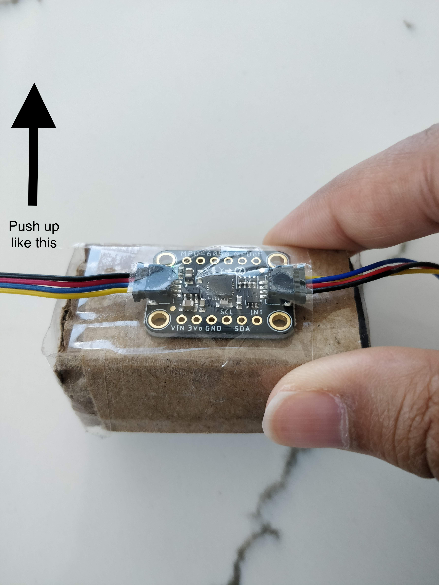

# Flappy Bird 2.0

Flappy Bird 2.0 is a simple implementation of the original Flappy Bird game. It involves 3 main modes and the user interacts solely with the web application to play the game. 

## Necessary Technology

For the sake of this project, you will need the following pieces of equipment:
- Raspberry Pi 4 with 4GB (https://www.adafruit.com/product/4296)
- Power supply (https://www.adafruit.com/product/4298)
- Microsd card (https://www.bhphotovideo.com/c/product/1536561-REG/silicon_power_sp032gbsthbv1v20sp_32gb_elite_a1_uhs_1.html/reviews)
- Stemma cables	(https://www.sparkfun.com/products/15081)
- Rotary encoder (https://www.sparkfun.com/products/15083)
- OLED screen	(https://www.sparkfun.com/products/17153)
- Accelerometer	(https://www.adafruit.com/product/3886)
- Joystick (https://www.sparkfun.com/products/15168)

## Setting Up the Code

Ensure you set up your raspberry pi with these devices plugged in and daisy chained together. Then, you will need to boot up your raspberry pi and SSH into it on the appropriate host:

```
ssh pi@sgd73.local
```

Proceed to enter your password and you will be logged in - remember that the hostname may defer if you are using your own personal raspberry pi.

You may want to perform the package installation from within a virtual environment, as it may interfere with some of the other packages you have installed on your system. Therefore, you must first run this code before installing any requirements:

```
pi@sgd73:~ $ virtualenv flappybird2
pi@sgd73:~ $ source flappybird2/bin/activate
(flappybird2) pi@sgd73:~ $
```

Then clone this repository locally (if you don't already have it), change to the appropriate directory and install all the necessary requirements:

```
(flappybird2) pi@sgd73:~ $ git clone https://github.com/shivanidoshi26/Interactive-Lab-Hub.git
(flappybird2) pi@sgd73:~ $ cd Interactive-Lab-Hub/Final\ Project/Flappy_Bird_2.0/
(flappybird2) pi@sgd73:~/Interactive-Lab-Hub/Final Project/Flappy_Bird_2.0 $ pip3 install -r requirements.txt
```

Once the requirements have been downloaded and all the technology has been plugged in and set up correctly, you should be able to start running the application!

To run the application simply run the following file:

```
(flappybird2) pi@sgd73:~/Interactive-Lab-Hub/Final Project/Flappy_Bird_2.0 $ python3 app.py
```

## Notes about the Technology

There are a few notes to take into account with regards to the technology. 

For the **joystick** mode, the bird will only jump when the joystick is pushed in the appropriate direction. Ensure that you orient the joystick such that you can read the text on it. To, then, make the bird jump, you will need to push the joystick up. Refer to the photographs below for further detail about this:

<p align="center">
   
</p>

For the **accelerometer** mode, the bird will only jump when the accelerometer is tilted in the correct direction. We recommend fastening the accelerometer on some flat medium, such that you don't get false readings by accident. Refer to the photographs below for further detail about how to set up and use the accelerometer:

<p align="center">
   
</p>

For the **arms** mode, you will need access to a browser that does not have security restrictions and permission issues with accessing the webcam. Though insecure, we recommend running the following command from your local computer (not from the raspberry pi) via the terminal - this is assuming you have and use Google Chrome as one of your browsers:

```
/Applications/Google\ Chrome.app/Contents/MacOS/Google\ Chrome --unsafely-treat-insecure-origin-as-secure="http://sgd73.local:5000/" --user-data-dir=~/Desktop/test_dir
```

We need to do this because Google Chrome restricts insecure URL's from being able to access any of the media devices. While this is a wonderful security measure, it does not help our application because we do not have an SSL certificate tied to it. 

Go ahead and accept the corresponding pop-up that shows on your screen after running the above. This will open a new Google Chrome browser with the security permissions unrestricted for the domain where our website will be hosted: http://sgd73.local:5000/. 

Proceed to the starting page of the game at http://sgd73.local:5000/new_game and get started playing. We hope you enjoy it and have a fun time triggering the frustration you once felt when playing this addictive game!

## References

Here is a non-exhaustive list of the most relevant references we took inspiration from to put our entire project together - all credit for originality goes to these people:
- https://medium.com/@sandraxrose/pythons-and-matrices-5f3c7ed6d5fb
- https://learn.adafruit.com/circuitpython-neotrellism4-flappybird/code
- http://www.lessmilk.com/tutorial/flappy-bird-phaser-1
- https://www.lesscake.com/phaser-game-tutorial
- https://github.com/rwightman/posenet-python
- https://drive.google.com/drive/folders/12U8ASmOhhkgCVm5xUsbZEDy-1popyIhL
- https://stackoverflow.com/questions/51309375/how-do-i-move-phaser-game-to-the-center-of-a-browser
- https://stackoverflow.com/questions/46109084/flask-is-not-render-template-before-executing-long-function
- https://kanchanardj.medium.com/redirecting-to-another-page-with-button-click-in-python-flask-c112a2a2304c
- https://phasergames.com/creating-endless-runner-game-phaser-part-5-game/
- https://github.com/rwightman/posenet-python
- https://github.com/tensorflow/tfjs-models/tree/master/posenet
- https://medium.com/tensorflow/real-time-human-pose-estimation-in-the-browser-with-tensorflow-js-7dd0bc881cd5
- https://processing-with-ai.gitlab.io/part2/computer-vision/
- https://medium.com/swlh/how-to-access-webcam-and-take-picture-with-javascript-b9116a983d78
- https://stackoverflow.com/questions/34165614/navigator-mediadevices-getusermedia-is-not-working-and-neither-does-webkitgetuse
