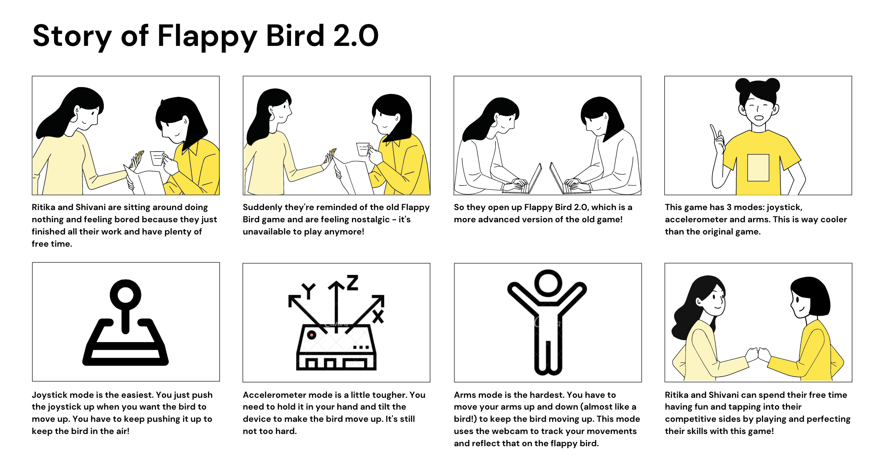

# Final Project

Using the tools and techniques you learned in this class, design, prototype and test an interactive device: Flappy Bird 2.0!
 
## Description

Flappy Bird is a mobile game developed by Vietnamese video game artist and programmer Dong Nguyen, under his game development company dotGears. The game is fairly simple and merely requires the player to control a bird on the screen. The goal of the game is to navigate the bird through a sort of obstacle course of green pipes. You have to try and get as far as you possibly can without hitting the green pipes or going out of the bounds of the screen (i.e. going to high up or too low). 

While this game sounds simple, it was always very tricky to get a high score and perform well - people have spent hours practicing and trying to get the motions correct. The game was discontinued due to the violent reactions people had when they lost. It was such an addicting game and it really pushed people to perform (or try to perform) well. The game is still available on some websites and some off-brand mobile apps.

Our goal for this final project was to replicate the game on a web application, but elevate the methods one could use to maneuver the bird. Ordinarily, a person would repeatedly tap on the mobile screen to keep the bird afloat, or repeatedly press the spacebar of your computer in the case of the web app. We decided to alter that and make use of some of the cool technology we were provided in this course. 

We, therefore, implemented 3 modes in our project: joystick, accelerometer and arms mode. The joystick mode is the easiest, accelerometer a bit tougher and arms the hardest. The following storyboard depicts a classic interaction:

 

Note: our intention with this project was not to trigger anyone's prior negative experiences with the game, but rather introduce slightly modified versions of the original and hopefully provide a fun, lively and interactive experience!

## Deliverables

1. Documentation of design process
2. Archive of all code, design patterns, etc. used in the final design. (As with labs, the standard should be that the documentation would allow you to recreate your project if you woke up with amnesia.)
3. Video of someone using your project (or as safe a version of that as can be managed given social distancing)
4. Reflections on process (What have you learned or wish you knew at the start?)

## Teams

## Examples

[Here is a list of good final projects from previous classes.](https://github.com/FAR-Lab/Developing-and-Designing-Interactive-Devices/wiki/Previous-Final-Projects)
This version of the class is very different, but it may be useful to see these.
