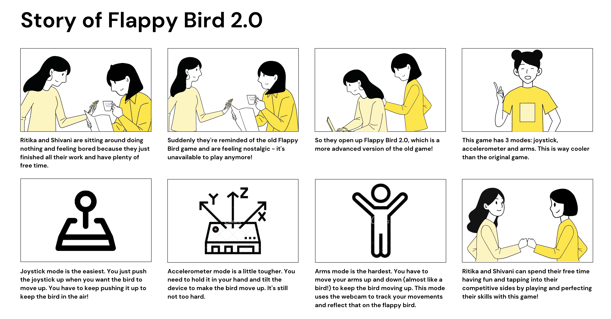

# Final Project

Using the tools and techniques we learned in this class, Ritika Poddar (rp477) and I (sgd73) designed, prototyped and tested an interactive device: Flappy Bird 2.0!
 
## Description

Flappy Bird is a mobile game developed by Vietnamese video game artist and programmer Dong Nguyen, under his game development company dotGears. The game is fairly simple and merely requires the player to control a bird on the screen. The goal of the game is to navigate the bird through a sort of obstacle course of green pipes. You have to try and get as far as you possibly can without hitting the green pipes or going out of the bounds of the screen (i.e. going too high or too low). Your score indicates how many pipes you were able to successfully pass through.

While this game sounds simple, it was always very tricky to get a high score and perform well - people have spent hours practicing and trying to get the motions correct. The game was discontinued due to the violent reactions people had when they lost. It was such an addicting game and it really pushed people to perform (or try to perform) well. The game is still available on some websites and some off-brand mobile apps.

Our goal for this final project was to replicate the game on a web application, but elevate the methods one could use to maneuver the bird. Ordinarily, a person would repeatedly tap on the mobile screen to keep the bird afloat, or repeatedly press the spacebar of your computer in the case of the web app. We decided to alter that and make use of some of the cool technology we were provided in this course. 

We, therefore, implemented 3 modes in our project: joystick, accelerometer and arms mode. The joystick mode is the easiest, accelerometer a bit tougher and arms the hardest. The following storyboard depicts a classic interaction:

 

We used Phaser to display the game and Posenet to detect the person's poses for **arms** mode.

Note: our intention with this project was not to trigger anyone's prior negative experiences with the game, but rather introduce slightly modified versions of the original and hopefully provide a fun, lively and interactive experience!

## Documentation of Design Process

The following sections detail out all the prototyping, coding, reflecting, demoing and so on that we went through to create this amazing rendition of the game.

## Archive of Everything

For extremely detailed instructions about how to get set up with the right packages, code and environment, please refer to the README in the Flappy_Bird_2.0 directory within this repository. Here is the link to the folder: https://github.com/shivanidoshi26/Interactive-Lab-Hub/tree/Spring2021/Final%20Project/Flappy_Bird_2.0.

Our ultimate goal for the physical design of the device was for it to be very simple. Since we were building up a game, we wanted all the technology to be close and well-connected. As we built a web application, one wouldn't be able to access the game without a computer. Having kept that in mind, we did our best to simplify the container for the rest of the technology. One of most important things we needed to keep in mind with our design was to orient the devices the right way, because our solution works with very specific directions and movements with the tech. 

If we had more experience and time to make use of the resources in the Maker Lab, we would've encased our devices in something more sturdy instead of cardboard. However, given the time and resource constraints we had, this is what we had to settle for.

Our initial design was exceedingly simple and, as you can see, there are some flaws with it. The accelerometer was not as handheld as we would've liked it to be and there's nothing really exciting about this set up.

 

After a bit of planning and drawing on paper, this was the slightly better encased version 2 of our design. Note that while there aren't a lot of improvements with the overall look of it, it will be small, enclose all the tech and wires and have the accelerometer be a separate more handheld device:

 

The second iteration was much better as it hid the raspberry pi as well, and the accelerometer was put in a piece of tech that could actually be held in your hand:

 

  

## Video Demos

Video taping our demo was a lot of fun. It gave us the chance to actually play the game a few times and really see how good we were at it. While there were many bloopers in making the video, the next few that you'll see are the more polished versions of that!

Here is a video demonstrating how the interaction works with the 2nd design we created above:

Since we didn't want to put anyone's health at jeopardy by having them demo the application, we decided to show you how it can be used ourselves. Though the design of the tech is with our older idea of the setup, we didn't think it necessary to reshoot the video because the design of the tech does not impact the interaction very much - the way to use the tech and the layout of things is mostly the same:

## Reflections

There were many take-aways from this experience and many improvements that we could make for the next iteration.

Takeaways:
- We needed to take so many components into account when building the application. Taking a step back and thinking about the interaction as just an interaction really helped us design the web application and the technology design better.
- Posenet was surprisingly tricky to figure out. We had to ensure we were processing the video feedback quick enough to reflect the changes on the actual game, such that it was all real-time and there was no delay.
- It was surprisingly difficult to figure out how to paper prototype the device. Having to come up with something that looked nice and wasn't too boring was not as easy it seemed. Ultimately, it would be nice to have a better looking container for the technology, but we did the best we could given the circumstances.

Improvements:
- We would try to attach an SSL certificate along with our domain, so that the process of actually using the web application isn't as complicated. It is not a fun interaction when you have to explicitly open up a new browser with specific permissions set and go through one extra step in this process just to get it up and running.
- It would be very interesting to try and host this application on a phone, as well as on the web. We didn't get the chance to play around with building a mobile application since we based our infrastructure on the lab 3 demo of the magic 8 ball.
- It would be nice if there was a bit of a delay before the user started playing when the game starts or restarts. Since the bird immediately starts to fly when the page loads, it might add a bit of anxiety or stress for the user to have to be prepared on the get-go.
- For the next iteration, we would love to incorporate a sound element - maybe some sound when the bird flies or a little tune at the start and end of the game. This will make the interaction feel a lot more authentic and enjoyable.
- It would be nice to not have such specific settings for the accelerometer and joystick. By this we mean that it would be nice to have the bird fly regardless of which direction you tilt the accelerometer or push the joystick. For simplicity sake, we kept this interaction as is. But maybe for the next iteration, we could incorporate some leeway such that the user doesn't have to think too much about the setup.
- There are still some small issues and kinks that need to be sorted with specifically the **arms** mode. It seems to send messages back and forth even when the game isn't being played - this is likely because the function we implemented is async. This can potentially interfere with the interaction by causing the system to slow down. It would be great to spend more time figuring out how to fix this.
- Next time, we would love to spend more time on building up the container of the technology. If it was sturdier and sleek-looking, it would look more professional.

Overall, we are very proud of achieving all of this amazing work in just 1 week!

## Teams

Ritika Poddar (rp477) and I decided to work together for the entirety of this project. The effort we both put in was extremely equal and we're both very happy with how we've worked as a team (for not only this project, but most of them throughout the semester). Specifically:
- Ritika started us off and implemented the basic infrastructure of the game.
- I cleaned up the UI and integrated all the components of the web application together to make a smooth web interaction.
- We figured out how to implement the accelerometer appropriately. 
- Ritika got the joystick working, which was quite easy to figure out once we'd figured out the accelerometer. 
- Ritika played around with posenet and got a basic version with the pi cam working - we decided to scrap using the pi cam due to issues with major delays and slowness.
- We collectively figured out how to instead perform all the arms code browser-side - for this we needed to gain access to the computer's web camera and use that input to process the subsequent actions. A big thanks to David Goedicke for staying on call for nearly an hour helping us figure out how to get the web cam working!
- We finally got arms to work pretty cleanly and process the input at a fairly normal rate.
- I reorganized the UI and made last-minute touches and improvements.

The documentation and code for our final project is the same on both hers and my repository. Here is a link to her final project repository, in any case: https://github.com/Rpoddar1953/Interactive-Lab-Hub/tree/Spring2021/Final%20Project.
