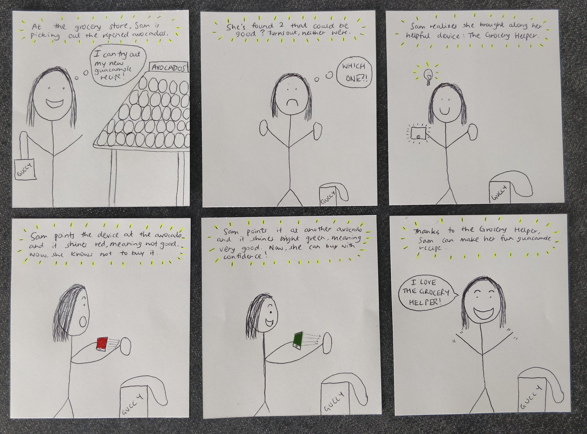
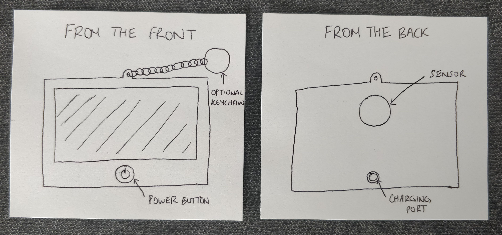
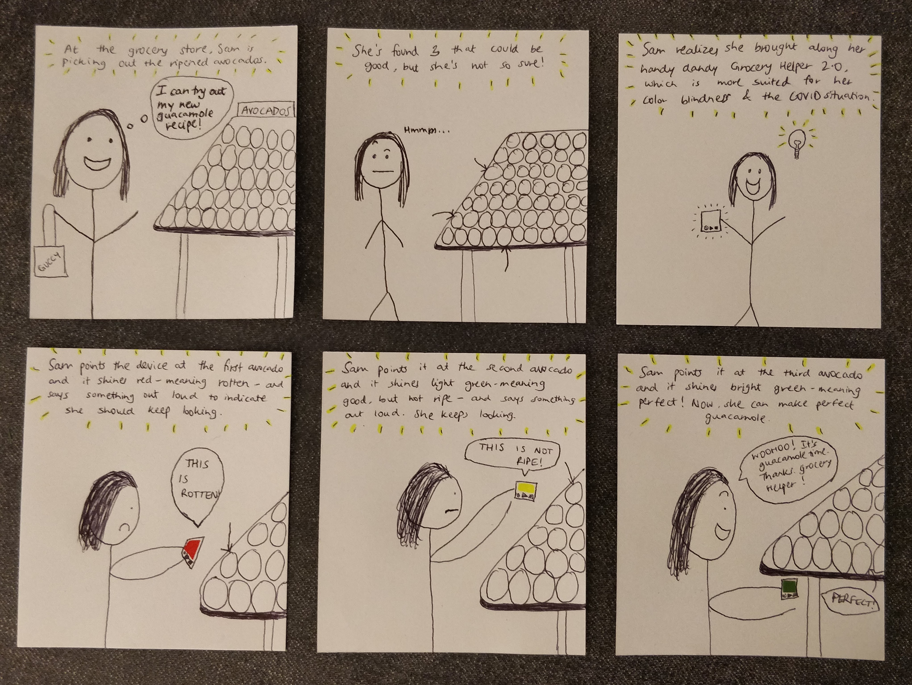

# Staging Interaction

In the original stage production of Peter Pan, Tinker Bell was represented by a darting light created by a small handheld mirror off-stage, reflecting a little circle of light from a powerful lamp. Tinkerbell communicates her presence through this light to the other characters. See more info [here](https://en.wikipedia.org/wiki/Tinker_Bell). 

There is no actor that plays Tinkerbell--her existence in the play comes from the interactions that the other characters have with her.

For lab this week, we draw on this and other inspirations from theatre to stage interactions with a device where the main mode of display/output for the interactive device you are designing is lighting. You will plot the interaction with a storyboard, and use your computer and a smartphone to experiment with what the interactions will look and feel like. _Make sure you read all the instructions and understand the whole of the laboratory activity before starting!_

## Prep

1. Set up [your Github "Lab Hub" repository](../../../) by [following these instructions](https://github.com/FAR-Lab/Developing-and-Designing-Interactive-Devices/blob/2021Spring/readings/Submitting%20Labs.md).
2. Set up the README.md for your Hub repository (for instance, so that it has your name and points to your own Lab 1) and [learn how](https://guides.github.com/features/mastering-markdown/) to post links to your submissions on your readme.md so we can find them easily.

### For lab, you will need:

1. Paper
1. Markers/ Pen
1. Smart Phone--Main required feature is that the phone needs to have a browser and display a webpage.
1. Computer--we will use your computer to host a webpage which also features controls
1. Found objects and materials--you’ll have to costume your phone so that it looks like some other device. These materials can include doll clothes, a paper lantern, a bottle, human clothes, a pillow case. Be creative!
1. Scissors

### Deliverables for this lab are: 
1. Storyboard
1. Sketches/photos of costumed device
1. Any reflections you have on the process.
1. Video sketch of the prototyped interaction.
1. Submit these in the lab1 folder of your class [Github page], either as links or uploaded files. Each group member should post their own copy of the work to their own Lab Hub, even if some of the work is the same for each person in the group.

## Overview
For this assignment, you are going to 

A) [Plan](#part-a-plan) 

B) [Act out the interaction](#part-b-act-out-the-interaction) 

C) [Prototype the device](#part-c-prototype-the-device)

D) [Wizard the device](#part-d-wizard-the-device) 

E) [Costume the device](#part-e-costume-the-device)

F) [Record the interaction](#part-f-record)

## The Report
This readme.md page in your own repository should be edited to include the work you have done. You can delete everything but the headers and the sections between the **stars**. Write the answers to the questions under the starred sentences. Include any material that explains what you did in this lab hub folder, and link it in the readme.

Labs are due on Mondays. Make sure this page is linked to on your main class hub page.

## Part A. Plan 

The interactive device can be anything *except* a computer, a tablet computer or a smart phone, but the main way it interacts needs to be using light.
**Describe your setting, players, activity and goals here.**

_Setting: Where is this interaction happening? (e.g., a jungle, the kitchen) When is it happening?_ 

Sam is headed on her weekly grocery run. Every time she goes, she struggles to find the ripe avocados, the sweet oranges, the non-disease-ridden lettuce and so on. She’s had to waste so much food as a result of buying nearly-rotten foods from the grocery store - not to mention the couple of encounters with food poisoning (yeesh!).

_Players: Who is involved in the interaction? Who else is there? If you reflect on the design of current day interactive devices like the Amazon Alexa, it’s clear they didn’t take into account people who had roommates, or the presence of children. Think through all the people who are in the setting._

Sam is the primary player here. When Sam invites her friends, Snigdha and Shivani, over for food they become the secondary players. The people around Sam at the grocery store are also secondary players here because they can learn from the device.

_Activity: What is happening between the actors?_

When Sam goes to the grocery store, she brings along The Grocery Helper. When the device is pointed to a specific food object, it detects whether the food is good to eat or not by displaying a green go-ahead color or a red don’t-buy color. Within the category of go-ahead colors, the different shades of green determine how mature the food item is, with the darker hues representing food that is absolutely ready to be consumed and the lighter hues the opposite. 

_Goals: What are the goals of each player? (e.g., jumping to a tree, opening the fridge)._ 

Sam’s goal is to find the best food to eat so she can accurately meal plan and she doesn’t waste any food in the process. She wants to eventually start cooking and delivering food from her home to help people during this pandemic, so she’ll need to buy the right groceries to do it.

Sketch a storyboard of the interactions you are planning. It does not need to be perfect, but must get across the behavior of the interactive device and the other characters in the scene. 
**Include a picture of your storyboard here**

Present your idea to the other people in your breakout room. You can just get feedback from one another or you can work together on the other parts of the lab.
**Summarize feedback you got here.**

- The initial idea I had was applying this in the wild. But everyone believed that it would be more appropriate in a grocery store/supermarket setting.
- How would you make sure that the device is pointing to the thing that you're actually trying to test?
- Fun idea!

## Part B. Act out the Interaction

Try physically acting out the interaction you planned. For now, you can just pretend the device is doing the things you’ve scripted for it. 

**Are there things that seemed better on paper than acted out?**

- How long would you have to hold up the device against the object for it to tell you whether it's safe to eat or not? If the device takes too long, people might not be inclined to use it because it would slow down their grocery shopping process.
- If people start recognizing the ways to determine food goodness on their own, there would be no need for the device. This would really only help a certain group of people.
- If the item being scanned is very big, such as a watermelon, would the device still be able to capture the entire object (since the device would have to be held a bit further away to get the entire item)?

**Are there new ideas that occur to you or your collaborators that come up from the acting?**

- Maybe the device could be on the shopping cart itself, rather than a handheld device. It would be more convenient than having to hold it.
- The keychain might not be a great idea to include because if the device breaks off or falls off, then the device could get lost.

## Part C. Prototype the device

You will be using your smartphone as a stand-in for the device you are prototyping. You will use the browser of your smart phone to act as a “light” and use a remote control interface to remotely change the light on that device. 

Code for the "Tinkerbelle" tool, and instructions for setting up the server and your phone are [here](https://github.com/FAR-Lab/tinkerbelle).

We invented this tool for this lab! 
**Give us feedback on Tinkerbelle.**

- I wish the buttons would get minimized when you interact with the device. 
- I feel that there should be some sort of "Need Help?" function on the website itself, in the event the person using the tool needs immediate assistance and doesn't want to reference the GitHub page.
- It would've been nice if I could select and "favorite" certain colors. There are only the pre-defined colors that you could automatically select. It would be nice to be able to add my own choices.
- Other than that, I think it's a great tool and I love the fact that the colors can be changed either by your laptop or your phone.

## Part D. Wizard the device
Take a little time to set up the wizarding set-up that allows for someone to remotely control the device while someone acts with it. Hint: You can use Zoom to record videos, and you can pin someone’s video feed if that is the scene which you want to record. 

**Include your first attempts at recording the set-up video here.**

https://youtu.be/I0bFwr-h9Dw

Now, hange the goal within the same setting, and update the interaction with the paper prototype. 

**Show the follow-up work here.**

https://youtu.be/NhCTkFXi9YY

## Part E. Costume the device

Only now should you start worrying about what the device should look like. Develop a costume so that you can use your phone as this device.

Think about the setting of the device: is the environment a place where the device could overheat? Is water a danger? Does it need to have bright colors in an emergency setting?

**Include sketches of what your device might look like here.**

**What concerns or opportunitities are influencing the way you've designed the device to look?**

The device ought to be easy to use, lightweight and chargeable. It should be small enough to fit in the actor's hand and should fit in their pocket as they keep shopping for food items. It could have a detachable keychain, in case the person wants to attach it to their bag.

## Part F. Record

**Take a video of your prototyped interaction.**

https://youtu.be/9lUx9wfE-DA

**Please indicate anyone you collaborated with on this Lab.**
Be generous in acknowledging their contributions! And also recognizing any other influences (e.g. from YouTube, Github, Twitter) that informed your design. 

Sam Lee (snlee159) and Snigdha Singhania (ss4224)

# Staging Interaction, Part 2 

This describes the second week's work for this lab activity.

## Prep (to be done before Lab on Wednesday)

You will be assigned three partners from another group. Go to their github pages, view their videos, and provide them with reactions, suggestions & feedback: explain to them what you saw happening in their video. Guess the scene and the goals of the character. Ask them about anything that wasn’t clear. 

**Summarize feedback from your partners here.**

- Maybe the device could go on the grocery cart itself.
- The device doesn’t have any buttons to say you’re ready to capture stuff. A “test freshness” button could be useful. Maybe also some words to express what each color means - a shopper might not automatically know what the different shades of green imply.
- The different shades of green didn’t show up in the videos and was difficult to interpret.
- The chocolate example wasn't particularly relevant (because who goes into a grocery store, unwraps something to check it and then wraps it back up and leaves it?)
- Someone liked the idea of keeping it in the form of a keychain, something that would be easy to carry.
- For the color hues, the addition of sound/text in the next iteration might be useful to cater to people who are color blind or if they are shopping outdoors where the sunlight can affect the brightness, hues won’t be prominent at that time.
- Another use case that it could be relevant for: due to COVID, it’s not recommended to touch items unnecessarily, so maybe you can use the scanner to scan and check if the product is vegan/organic/vegetarian etc. (the device will scan the product and get this information from google perhaps).

## Make it your own

Do last week’s assignment again, but this time: 
1) It doesn’t have to (just) use light, 
2) You can use any modality (e.g., vibration, sound) to prototype the behaviors, 
3) We will be grading with an emphasis on creativity. 

**Document everything here.**

