# You're a wizard, Doshi

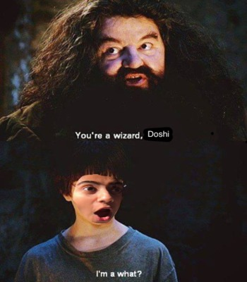

In this lab, we want you to practice wizarding an interactive device as discussed in class. We will focus on audio as the main modality for interaction but there is no reason these general techniques can't extend to video, haptics or other interactive mechanisms. In fact, you are welcome to add those to your project if they enhance your design.

## Contributions

I worked with Ritika Poddar (rp477) for the entirety of this lab. We came up with PuzzleBot together, coded everything in parallel and made the video with each other. Here is a link to her lab 3 repo: https://github.com/Rpoddar1953/Interactive-Lab-Hub/tree/Spring2021/Lab%203. We also made use of the following tools online:
- Canva to build the sketch of our idea
- iMovie to edit our video
- For the riddles: https://parade.com/947956/parade/riddles/
- Online photo editing tools for the little meme at the top of this README (lol)

## Text to Speech and Speech to Text

In the home directory of your Pi there is a folder called `text2speech` containing some shell scripts.

```
pi@ixe00:~/text2speech $ ls
Download        festival_demo.sh  GoogleTTS_demo.sh  pico2text_demo.sh
espeak_demo.sh  flite_demo.sh     lookdave.wav

```

you can run these examples by typing 
`./espeakdeom.sh`. Take some time to look at each script and see how it works. You can see a script by typing `cat filename`

```
pi@ixe00:~/text2speech $ cat festival_demo.sh 
#from: https://elinux.org/RPi_Text_to_Speech_(Speech_Synthesis)#Festival_Text_to_Speech

echo "Just what do you think you're doing, Dave?" | festival --tts

```

You can also play audio files directly with `aplay filename`.

After looking through this folder do the same for the `speech2text` folder. In particular, look at `test_words.py` and make sure you understand how the vocab is defined. Then try `./vosk_demo_mic.sh`

## Serving Pages

In Lab 1 we served a webpage with flask. In this lab you may find it useful to serve a webpage for the controller on a remote device. Here is a simple example of a webserver.

```
pi@ixe00:~/$ python server.py
 * Serving Flask app "server" (lazy loading)
 * Environment: production
   WARNING: This is a development server. Do not use it in a production deployment.
   Use a production WSGI server instead.
 * Debug mode: on
 * Running on http://0.0.0.0:5000/ (Press CTRL+C to quit)
 * Restarting with stat
 * Debugger is active!
 * Debugger PIN: 162-573-883
```
From a remote browser on the same network, check to make sure your webserver is working by going to [http://ixe00.local:5000]()

## Demo

In the [demo directory](./demo), you will find an example wizard of oz project you may use as a template. **You do not have to** feel free to get creative. In that project, you can see how audio and sensor data is streamed from the Pi to a wizard controller that runs in the browser. You can control what system says from the controller as well.

## Optional

There is an included [dspeech](./dspeech) demo that uses [Mozilla DeepSpeech](https://github.com/mozilla/DeepSpeech) for speech to text. If you're interested in trying it out we suggest you create a seperarate virutalenv. 

# Lab 3 Part 2

Create a system that runs on the Raspberry Pi that takes in one or more sensors and requires participants to speak to it. Document how the system works and include videos of both the system and the controller.

## Prep for Part 2

1. Sketch ideas for what you'll work on in lab on Wednesday.

Ritika and I came up with the idea during the lab on Wednesday. We decided to play with an idea that revolved around escape rooms because those are really interactive, enjoyable and fun. This is the sketch we came up with:
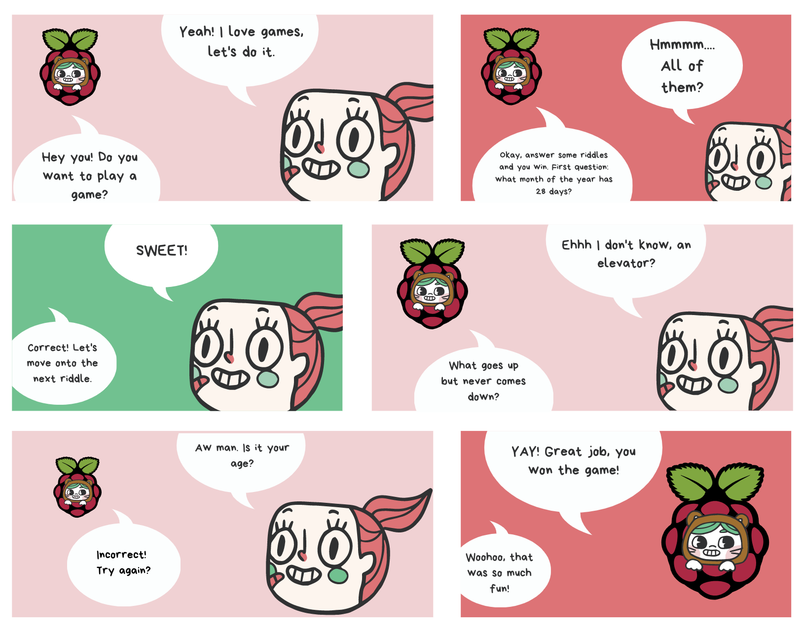

## Share your idea sketches with Zoom Room mates and get feedback

*What was the feedback? Who did it come from?*

- Sam Lee really liked the idea, and gave us some feature recommendations - using the LED's to denote right or wrong answers. She was the inspiration for the idea (ty Sam!)
- Niki Agrawal really liked the idea also, and couldn't wait to see it executed. 
- Ilan Mandel thought that the idea we had was a great one, and definitely technically feasible.

## Prototype your system

The system should:
* use the Raspberry Pi 
* use one or more sensors
* require participants to speak to it. 

*Document how the system works*

These are all the features we incorporated/the devices we used for our wizard interaction:
- Raspberry pi + power supply
- We used a speaker - connected via an AUX cord - to communicate all the instructions, the riddles and any other relevant remarks to the user
- We used the Adafruit Mini PiTFT screen to display the images of the welcome page, the closed/opened doors and the congratulations message at the end
- We used the proximity sensor to detect when someone is passing by, so as to activate the game and encourage them to play along
- We used the joystick to navigate to each of the different rooms and solve the corresponding riddle
- We used the red and green LED buttons to visually indicate to the user whether they got the answer right or wrong
- We used the mic to capture the user input, so that we could verify if the user's answer was right or not - this was fully automated (not wizarded) and there was no real need for an external controller

This is what the sequence of actions would be:
- A user walks by the device which triggers the proximity sensor
- The device greets the user and tells them how to play the game via the speaker - the goal is to solve 4 riddles to win
- The user uses the joystick to navigate to one of the 4 riddles, which is communicated via the speaker to the user
- The user has 10 seconds to come up with an answer and speak it directly into the mic
- If it's correct, the graphic on the screen changes from a closed door to an open one and the green LED turns on for a short while; if the user comes back to a door for a riddle that has already been solved, the system displays the corresponding open door graphic and tells them the riddle has already been solved
- If it's incorrect, the user is instructed on how to replay the question to try again and the red LED turns on for a short while
- Once the user answers each of the 4 riddles correctly, they are greeted with a "Congratulations!" graphic on the screen and a short congratulatory message from the system

*Include videos or screencaptures of both the system and the controller.*

Video demo: https://drive.google.com/file/d/1if4Wd0Cvh_kE6f_orL4BXskNBZukgOEU/view?usp=sharing

Since we didn't actually have a controller because we automated the entire interaction, here is an example picture of the console logs that we used to help debug our system and ensure it was working correctly:
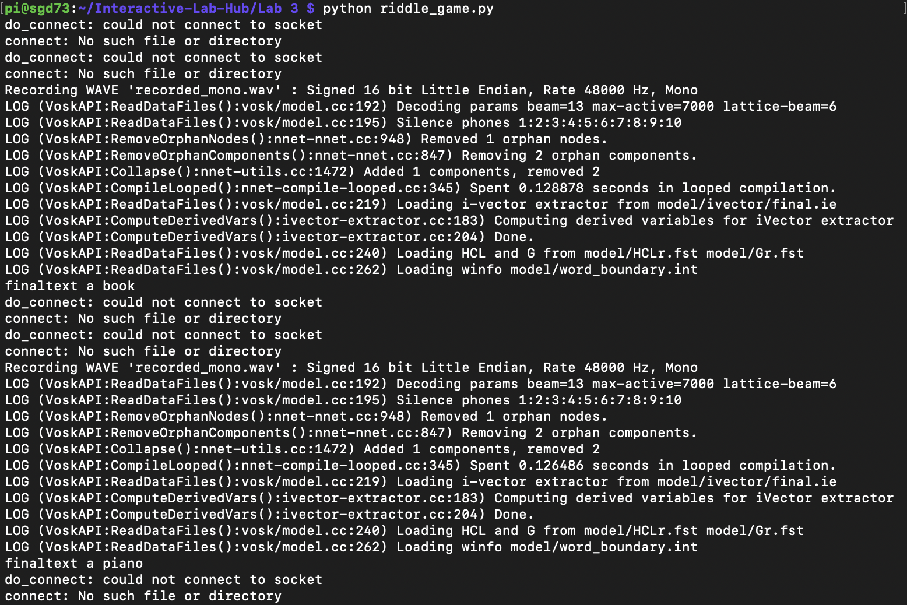

As you can see, between the log outputs there are print-outs that say "finaltext...". Everything beyond "finaltext" is what the system processed as the user's verbal input. In this way, we could check and make sure that they said the right answer to the riddle.

## Test the system
Try to get at least two people to interact with your system. (Ideally, you would inform them that there is a wizard _after_ the interaction, but we recognize that can be hard.)

We asked Snigdha Singhania and Anu Deodhar to test out our system. They were informed about how to interact with the tool, but not that there was a live interaction involved. The tests went off pretty smoothly. Here are some pictures of them playing around with it:

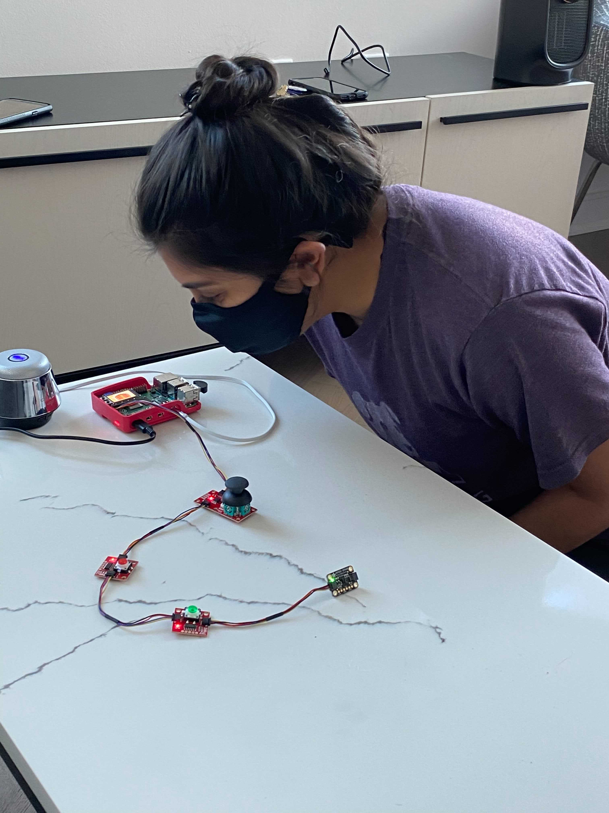

 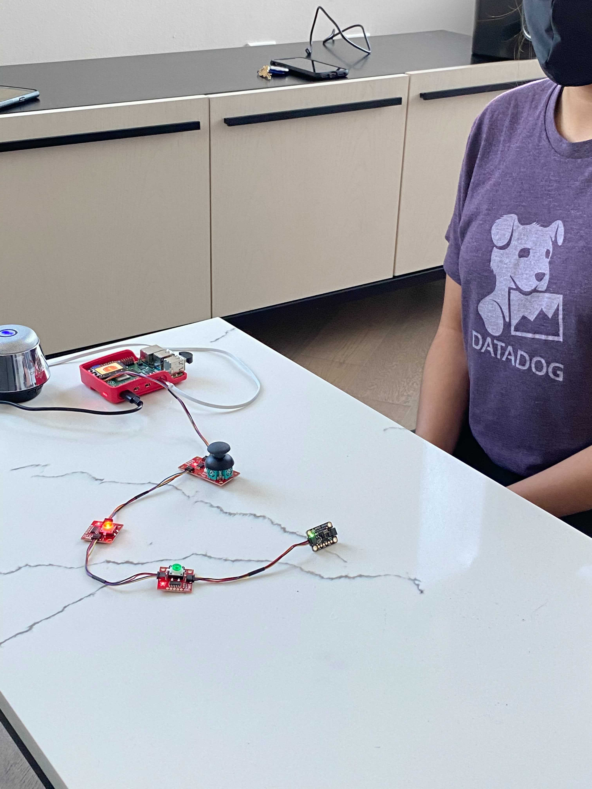 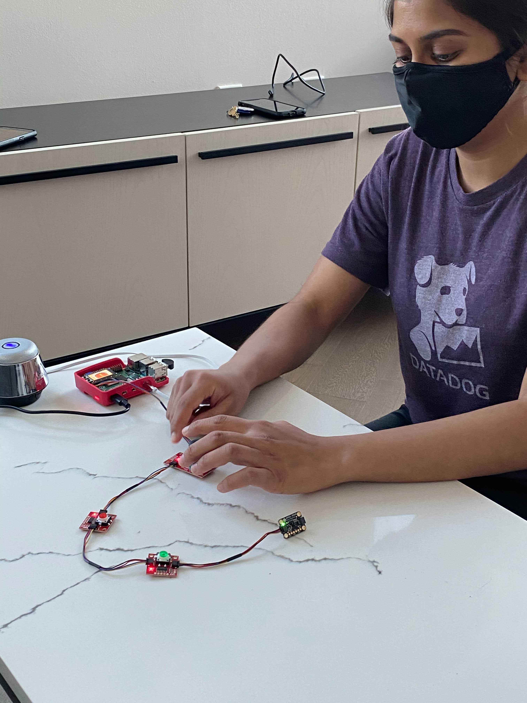

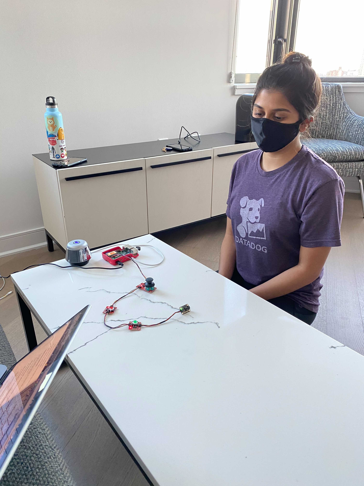 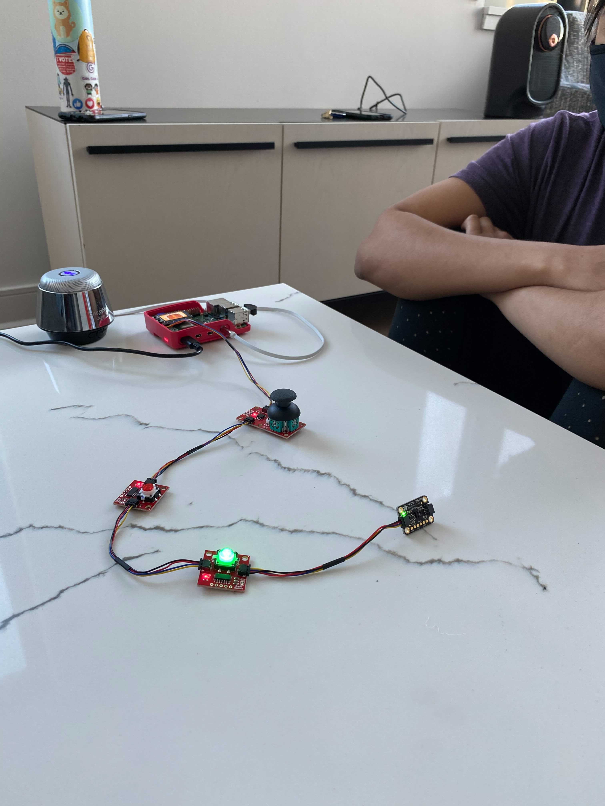

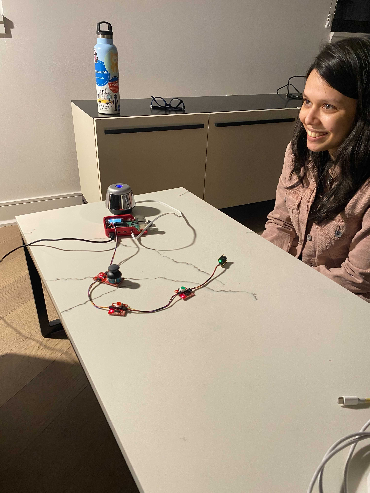 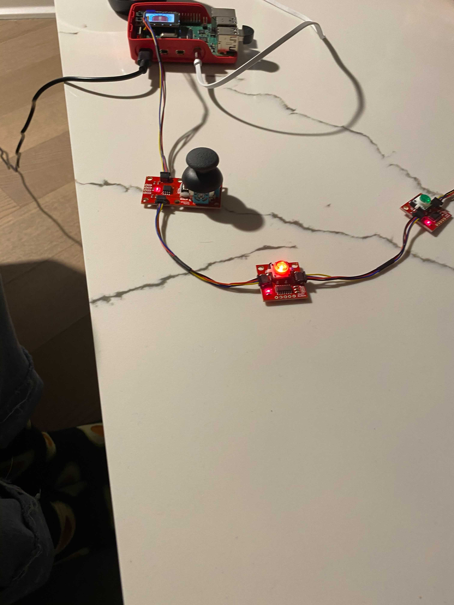 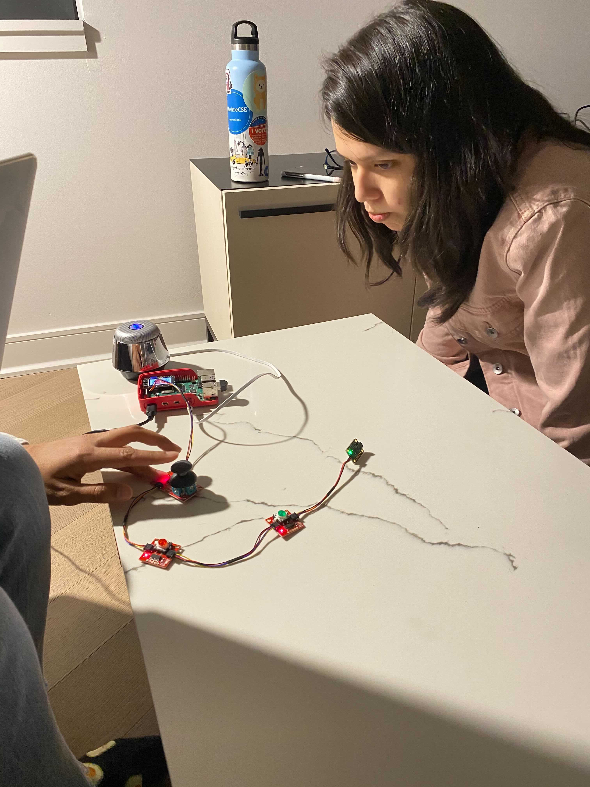

Answer the following:

### What worked well about the system and what didn't?
Worked Well:
* The joy stick navigation worked well, both Snigdha and Anu understood how to use it to view the doors with minimal explanation.
* Both participants were able to work through the entire riddle game.
* Snigdha thought the text to speech voice used for the instructions and riddles was very clear and easy to understand.

Didn't work well:
* The voice to text recognition for checking the user's answers to the riddles was not consistent. It either didn't recognzie someone had spoken because the mic didn't pick it up, or didn't understand the answer because of the participant's accent. 
* The voice to text function took a long time to run, which meant that the participants were often waiting to see if their answer was correct.

### What worked well about the controller and what didn't?
We tried to make our system completely autonomous so that it spoke instructions and analyzed user input on its own, while we monitored the progress though logs in the terminal as the user interacted with the system. 

Worked well:
* We could see what the speech to text interepreted the user's answer as, and see when there were issues with the interpretations. 

Didn't work well:
* Because there was no way for us to directly control the system, only monitor it, we couldn't interject when there was an issue without talking to the participant directly and interrupting the interaction. This broke the sense of autonomy that the system had, and broke the flow of the interaction. 

### What lessons can you take away from the WoZ interactions for designing a more autonomous version of the system?
* There need to be more visual cues provided by the system to explain how to use the different sensors and widgets, in order to limit the amount of prior explanation needed.
* If using a system that interprets the user input on its own, the way the speech to text function was for us, then it needs to be more robust and applicable to a variety of situations (i.e., someone having an accent). 

### How could you use your system to create a dataset of interaction? What other sensing modalities would make sense to capture?
* We could log and store all of the user's answers to the questions, which could help us identify if there are any issues responding to the bot as well as determine how long the bot should wait before analyzing their answer. 
* We could also store the directions that the user toggles the joy stick, which can help streamline the navigation.
* Next time we could use the gesture sensor to enhance the interaction and capture how close or far the user tends to stand to the mic, in order to make sure their audio is being captured. 
