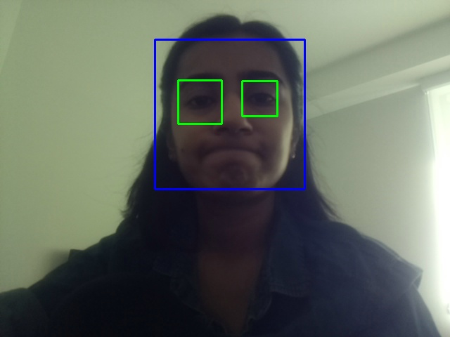
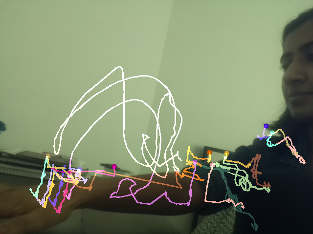
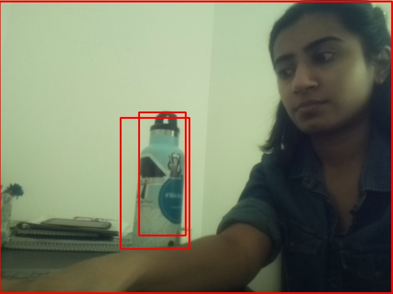
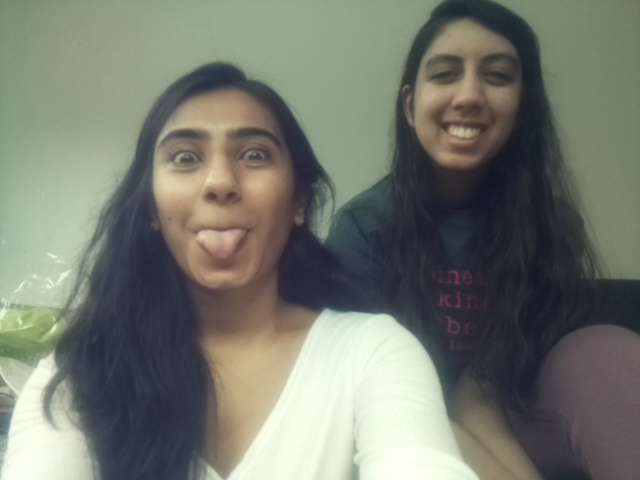

# Observant Systems


For lab this week, we focus on creating interactive systems that can detect and respond to events or stimuli in the environment of the Pi, like the Boat Detector we mentioned in lecture. 
Your **observant device** could, for example, count items, find objects, recognize an event or continuously monitor a room.

This lab will help you think through the design of observant systems, particularly corner cases that the algorithms need to be aware of.

In Lab 5 part 1, we focus on detecting and sense-making.

In Lab 5 part 2, we'll incorporate interactive responses.

### Collaborators

I worked with Ritika Poddar on this lab (rp477). We coded up the sensor data processing code and built the face detector and object detector together. Here is the link to her repo: https://github.com/Rpoddar1953/Interactive-Lab-Hub/tree/Spring2021/Lab%205.

## Prep

1.  Pull the new Github Repo.
2.  Read about [OpenCV](https://opencv.org/about/).
3.  Read Belloti, et al's [Making Sense of Sensing Systems: Five Questions for Designers and Researchers](https://www.cc.gatech.edu/~keith/pubs/chi2002-sensing.pdf)

### For the lab, you will need:

1. Raspberry Pi
1. Raspberry Pi Camera (2.1)
1. Microphone (if you want speech or sound input)
1. Webcam (if you want to be able to locate the camera more flexibly than the Pi Camera)

### Deliverables for this lab are:
1. Show pictures, videos of the "sense-making" algorithms you tried.
1. Show a video of how you embed one of these algorithms into your observant system.
1. Test, characterize your interactive device. Show faults in the detection and how the system handled it.


## Overview
Building upon the paper-airplane metaphor (we're understanding the material of machine learning for design), here are the four sections of the lab activity:

A) [Play](#part-a)

B) [Fold](#part-b)

C) [Flight test](#part-c)

D) [Reflect](#part-d)

---

### Part A
### Play with different sense-making algorithms.

Befor you get started connect the RaspberryPi Camera V2. [The Pi hut has a great explanation on how to do that](https://thepihut.com/blogs/raspberry-pi-tutorials/16021420-how-to-install-use-the-raspberry-pi-camera).  

#### OpenCV
A more traditional to extract information out of images is provided with OpenCV. The RPI image provided to you comes with an optimized installation that can be accessed through python.

Additionally, we also included 4 standard OpenCV examples. These examples include contour(blob) detection, face detection with the ``Haarcascade``, flow detection(a type of keypoint tracking), and standard object detection with the [Yolo](https://pjreddie.com/darknet/yolo/) darknet.

Most examples can be run with a screen (I.e. VNC or ssh -X or with an HDMI monitor), or with just the terminal. The examples are separated out into different folders. Each folder contains a ```HowToUse.md``` file, which explains how to run the python example.

```shell
pi@ixe00:~/openCV-examples $ tree -l
.
├── contours-detection
│   ├── contours.py
│   └── HowToUse.md
├── data
│   ├── slow_traffic_small.mp4
│   └── test.jpg
├── face-detection
│   ├── face-detection.py
│   ├── faces_detected.jpg
│   ├── haarcascade_eye_tree_eyeglasses.xml
│   ├── haarcascade_eye.xml
│   ├── haarcascade_frontalface_alt.xml
│   ├── haarcascade_frontalface_default.xml
│   └── HowToUse.md
├── flow-detection
│   ├── flow.png
│   ├── HowToUse.md
│   └── optical_flow.py
└── object-detection
    ├── detected_out.jpg
    ├── detect.py
    ├── frozen_inference_graph.pb
    ├── HowToUse.md
    └── ssd_mobilenet_v2_coco_2018_03_29.pbtxt
```
Result of contour detection:


Result of face detection:



Result of flow detection:



Result of object detection:



#### Filtering, FFTs, and Time Series data.
Additional filtering and analysis can be done on the sensors that were provided in the kit. For example, running a Fast Fourier Transform over the IMU data stream could create a simple activity classifier between walking, running, and standing.

Using the set up from the [Lab 3 demo](https://github.com/FAR-Lab/Interactive-Lab-Hub/tree/Spring2021/Lab%203/demo) and the accelerometer, try the following:

**1. Set up threshold detection** Can you identify when a signal goes above certain fixed values?

This was the code that was written in demo/app.py (we added it directly into the handle_message() function):

```
# THRESHOLD DETECTION
currAccel = mpu.acceleration
if currAccel[0] > 10.0:
    print("-----------------X-direction-----------------")
    print("Acceleration: X:%.2f, Y: %.2f, Z: %.2f m/s^2" % (currAccel))
if currAccel[1] > 5.0:
    print("-----------------Y-direction-----------------")
    print("Acceleration: X:%.2f, Y: %.2f, Z: %.2f m/s^2" % (currAccel))
if currAccel[2] > 11.0:
    print("-----------------Z-direction-----------------")
    print("Acceleration: X:%.2f, Y: %.2f, Z: %.2f m/s^2" % (currAccel))
```

We picked random thresholds for the x, y and z direction. When the threshold is met, the current acceleration is printed out to the console.

**2. Set up averaging** Can you average your signal in N-sample blocks? N-sample running average?

This was the code that was written in demo/app.py (N was set to 10 in this example):

```
# AVERAGING
global i
global num
global currSumX
global currSumY
global currSumZ

if i < num:
    i += 1
    currSumX += currAccel[0]
    currSumY += currAccel[1]
    currSumZ += currAccel[2]
else:
    averageSum = (currSumX/num, currSumY/num, currSumZ/num)
    print("Average: X:%.2f, Y: %.2f, Z: %.2f m/s^2" % (averageSum))
    i = 0
    currSumX = 0
    currSumY = 0
    currSumZ = 0
```

This was the initialization of the global variables, and was defined outside the scope of the handle_message() function:

```
num = 10
i = 0
currSumX = 0
currSumY = 0
currSumZ = 0
```

**3. Set up peak detection** Can you identify when your signal reaches a peak and then goes down?

This was the code that was written in demo/app.py (we added it directly into the handle_message() function):

```
# PEAK DETECTION
global pre
global cur
global peakCtr

pre = cur
cur = currAccel
if cur[0] - pre[0] > thresh:
    print("PEAK! ", peakCtr)
    peakCtr += 1
```

This was the initialization of the global variables, and was defined outside the scope of the handle_message() function:

```
pre = (-float('inf'), -float('inf'), -float('inf'))
cur = (-float('inf'), -float('inf'), -float('inf'))
thresh = 2.0
peakCtr = 0
```

We checked for peaks by comparing the current acceleration value with the previous (since a peak can only be detected after it's occurred). We used a threshold of 2.0 to remove all small peaks and to only detect the larger ones.

Include links to your code here, and put the code for these in your repo--they will come in handy later.

**All the code written above can be found in this file:** https://github.com/shivanidoshi26/Interactive-Lab-Hub/blob/Spring2021/Lab%205/demo/app.py

#### Teachable Machines (beta, optional)
Google's [TeachableMachines](https://teachablemachine.withgoogle.com/train) might look very simple.  However, its simplicity is very useful for experimenting with the capabilities of this technology.

You can train a Model on your browser, experiment with its performance, and then port it to the Raspberry Pi to do even its task on the device.

Here is Adafruit's directions on using Raspberry Pi and the Pi camera with Teachable Machines:

1. [Setup](https://learn.adafruit.com/teachable-machine-raspberry-pi-tensorflow-camera/raspberry-pi-setup)
2. Install Tensorflow: Like [this](https://learn.adafruit.com/running-tensorflow-lite-on-the-raspberry-pi-4/tensorflow-lite-2-setup), but use this [pre-built binary](https://github.com/bitsy-ai/tensorflow-arm-bin/) [the file](https://github.com/bitsy-ai/tensorflow-arm-bin/releases/download/v2.4.0/tensorflow-2.4.0-cp37-none-linux_armv7l.whl) for Tensorflow, it will speed things up a lot.
3. [Collect data and train models using the PiCam](https://learn.adafruit.com/teachable-machine-raspberry-pi-tensorflow-camera/training)
4. [Export and run trained models on the Pi](https://learn.adafruit.com/teachable-machine-raspberry-pi-tensorflow-camera/transferring-to-the-pi)

Alternative less steps option is [here](https://github.com/FAR-Lab/TensorflowonThePi).

For the sake of a simple demonstration, I trained a model to detect a phone, a water bottle and a pillow. Here is a video of the trained model and detection on Teachable Machines:

[](https://drive.google.com/file/d/1Jz6quhKJpN632zMwSfKU1M9CUO0I1wCI/view?usp=sharing "")

Here is a video of the pi cam in action detecting the phone, water bottle and pillow quite well:

[](https://drive.google.com/file/d/1B56yowbpyk2vvhupi311Y3NvfBT_UXpK/view?usp=sharing "")

#### PyTorch  
As a note, the global Python install contains also a PyTorch installation. That can be experimented with as well if you are so inclined.

### Part B
### Construct a simple interaction.

Pick one of the models you have tried, pick a class of objects, and experiment with prototyping an interaction.
This can be as simple as the boat detector earlier.
Try out different interactions outputs and inputs.
**Describe and detail the interaction, as well as your experimentation.**

One of the observant systems we played around with was the face detection. We decided to create a photobooth style interaction, in which the user is prompted with a question asking whether they would like to take a photo. To incorporate the face detection concept, we prompt the user to take a photo only when their face is detected by the pi cam. If there is any other object other than a recognizable face, the user cannot take a picture. To take a photograph, the user has to click the button and it gets saved in the local folder. The idea was very simple and mainly focussed on triggering the photo functionality. If you click the button when there is no face, no photo is taken. A few points of interest with this interaction:
- The face detection didn't work very well when it was dark
- If the camera was held at any angle that wasn't straight, the face wasn't detected
- If your face isn't visible within a specific range of the camera's view, the face isn't detected
- When funny faces were made in front of the camera, the face wasn't detected

Ritika and I took some great photos together:

 

  

The other thing we tried was object detection and we tried building a teachable machines model. We built a plant detection interaction that a user can use to determine whether their plant needs to be watered. We built a teachable machines model to recognize two types of flowers, a potted plant, and a fake succulent. The user can place their plant in front of the pi camera and if the model recoginzes the plant it will show the name on the screen and say whether the plant needs to be watered, if the plant is fine, or if the plant is fake. We also provide feedback using the LED lights along with the voice, so if the plant needs watering then the red light turns on, if the plant is healthy the green light turns on, and if the plant is fake both the red and green lights turn on. We decided to move forward with out plant detection idea.

Here is a short video demonstrating the trained model on teachable machines:

[](https://drive.google.com/file/d/14KoTUkC8BK4zjgO9KHrDehFMCi4s8S-p/view?usp=sharing "")

### Part C
### Test the interaction prototype

Now flight test your interactive prototype and **note your observations**:
For example:
1. When does it do what it is supposed to do?

The plant detection model detects plants in day light in front of a white background with no other images behind the plant. We think this is partly due to the way we took the initial photos of the plants, and also because it limits the amount of background noise that confuses the model.

2. When does it fail?

There are many times when it fails to identify the flower correctly. We ran into an issue where the mdoel would frequently classify everything as a succuclent.

3. When it fails, why does it fail?

The model fails whenever the angle of the flower is not one that was used in the model training, or if there is something in the background. We also think it was constantly identifying plants as succulents because of the green stem or leaves of the flowers which might look similart to the succulent.

4. Based on the behavior you have seen, what other scenarios could cause problems?

We imagine that bad lighting or having a hand in the camera frame could also cause issues. The model needs a clear and bright background in order to identify the plants correctly. Also looking at the plant from far away could cause issues.

**Think about someone using the system. Describe how you think this will work.**
1. Are they aware of the uncertainties in the system?

They would probably have to try a few times in order to get the correct angles for the model to behave properly.

2. How bad would they be impacted by a miss classification?

A misclassification wouldn't be too bad, unless it was misclassified as the fake succulent in which case the model will tell the user that their plant is fake and they should throw it away.

3. How could change your interactive system to address this?

We could have a voice or instructions on a screen that instructs the user to move closer or adjust the plant in order to aid the model in identifying it.

4. Are there optimizations you can try to do on your sense-making algorithm.

We think that having a more robust model with a large dataset of images will help with these issues. If the model is trained on almost every possible angle, lighting, and positition a plant can be in then it is more likely to correctly identify the plant in different settings.

### Part D
### Characterize your own Observant system

Now that you have experimented with one or more of these sense-making systems **characterize their behavior**.
During the lecture, we mentioned questions to help characterize a material:
* What can you use X for?
* What is a good environment for X?
* What is a bad environment for X?
* When will X break?
* When it breaks how will X break?
* What are other properties/behaviors of X?
* How does X feel?

**Include a short video demonstrating the answers to these questions.**

We created a storyboard to demonstrate how our device could be used:


### Part 2.

Following exploration and reflection from Part 1, finish building your interactive system, and demonstrate it in use with a video.

**Include a short video demonstrating the finished result.**

Here is a short video to demonstrate the functionality we created with the face detection photobooth:

[](https://drive.google.com/file/d/1wbH6gI6LI6RqyBw_SfGFtFqpOmXMKk4C/view?usp=sharing "")

Here is a short video to demonstrate the functionality we created with the botanist:

[](https://drive.google.com/file/d/1qqeBXlIsvRo2rQTSCrBQodnvQ2NM9pIu/view?usp=sharing "")

 
